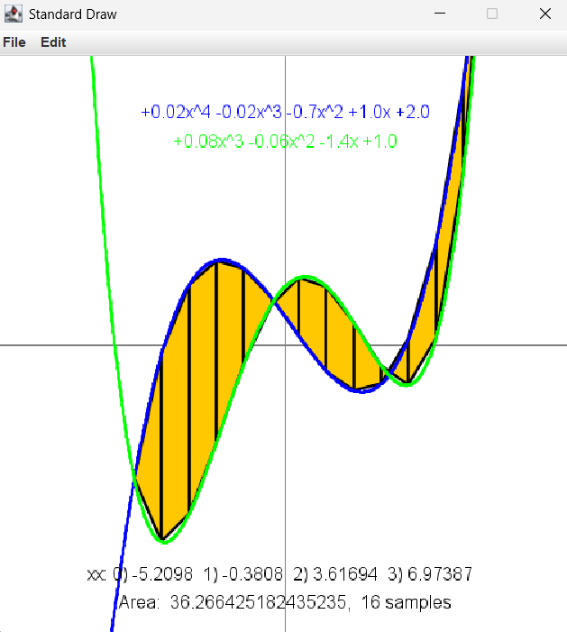

# I2CS_Ex1 - Static Functions on Polynomials

**Course:** Introduction to Computer Science (Ariel University, 2026)  
**Assignment:** Ex1 – Basic programming: static functions, arrays, and JUnit.

## Overview
This project implements a set of **static functions** over 1D arrays representing polynomials and provides **JUnit tests** for each function.  
The given GUI (`Ex1_GUI.java`) uses `StdDraw` to visualize the polynomial and numeric computations.

## Files in the Project
- `Ex1.java` – Implemented static functions (editable)
- `Ex1Test.java` – JUnit tests for all functions (editable)
- `Ex1_GUI.java` – GUI for visualization (do not modify)
- `StdDraw.java` – Graphics helper (do not modify)

## *Functions in Ex1 and all of their descriptions:*

* `f` - Computes the f(x) value of the polynomial function at x.

* `root_rec` - Given a polynomial function (p), a range [x1,x2] and an epsilon eps. This function computes an x value (x1<=x<=x2) for which |p(x)| < eps.

* `PolynomFromPoints` - Computes the coefficients of a polynomial that passes through a given set of 2D points.

* `equals` - Checks whether two polynomial functions are equal.

* `poly` - Converts a polynomial represented as an array of coefficients into a human-readable string.

* `sameValue` - Finds an x-value within a given range where two polynomial functions are approximately equal.

* `length` - Approximates the arc length of a polynomial function over a given interval.

* `area` - Approximates the area between two polynomial functions over a given interval using a trapezoidal method.

* `getPolynomFromString` - Converts a string representation of a polynomial into an array of coefficients.

* `add` - Computes the sum of two polynomial functions.

* `mul` - Computes the product of two polynomial functions.

* `derivative` - Computes the derivative of a polynomial function.

## *Extra functions and their descriptions:*

* `getcoefficient` - Extracts the numeric coefficient from an algebraic term string.

* `reverseArray` - Reverses the elements of the given array in place.

* `calctrianglearea` - Calculates the area of a triangle using its base and height.

* `calctrapezoidarea` - Calculates the area of a trapezoid using its two bases and height.

* `getxpower` - Extracts the exponent (power) of x from an algebraic term string.

## *Result:*

